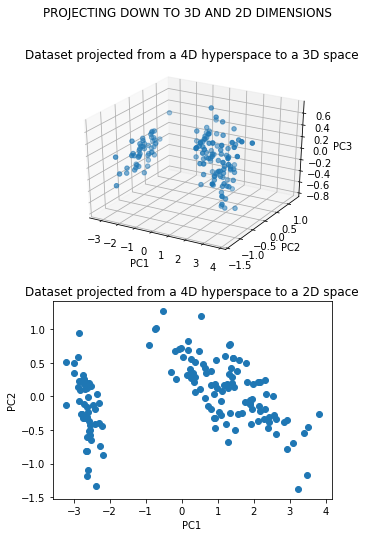
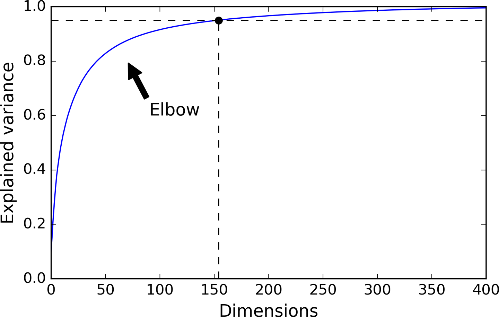
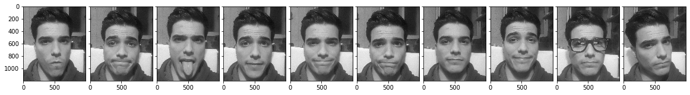
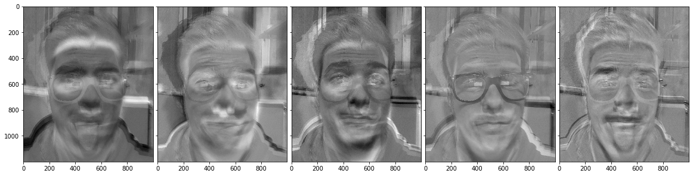
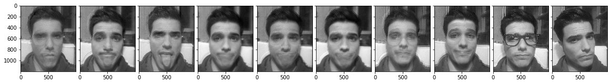

# Data Dimensionality Reduction in Hyperspaces

PCA is very useful for reducing many dimensions into a smaller set of dimensions, as humans can not visualize data on more than 3 dimensions it is usually helpful to reduce multidimensional datasets into 2 or 3 dimensions and graph them in order to get a better understanding of the data.

Many dimensionality reduction algorithms work by modeling the *mainfold* on wich the training instances lie, this is called Mainfold learning. It relies on the mainfold assumption, also called the mainfold hypothesis, wich holds that most real-world high-dimensional datasets lie close to a much lower-dimensional mainfold.

The mainfold assumption is often accompained by another implicit assumption: that the task at hand (e.g., classification or regression) will be simplier if expressed in the lower-dimensional space of the mainfold.


## PCA: Principal Component Analysis
Is by far the most popular dimensionality reduction algorithm. First identifies the hyperplane that lies closest to the data, and then it projects the data onto it.

### Preserving the variance:
Before we can project the training set onto a lower-dimensional hyperplane, you first need to choose the right hyperplane. It seems reasonable to select the axis that preserves the maximum amount of variance, as will most likely lose less information than other projections. Another way to justify this choice is that it is the axis that minimizes the mean squared distance between the original dataset and its projection onto that axis. This is the rather simple idea behind PCA.

Further reading here: https://www.tandfonline.com/doi/abs/10.1080/14786440109462720


### Principal components:
PCA identifies the axis that accounts for the largest amount of variance in the training set. The unit vector that defines the ith axis is called the ith principal component (PC). In the figure above the first two PCs are represented by the ortogonal arrows in the plane, and the third PC would be orthogonal to the plane.

To find the PCs of a training set there is a standard matrix factorization technique called *Singular Value Decomposition* (SDV) that can decompose the traning set matrix into the matrix multiplication of three matrices.


\begin{align}
a = U \sum V^T
\end{align}

Where V contains all the principal components thata we are looking for.

## A simple demonstration:

### 00. Loading the libraries


```python
from sklearn import datasets as ds
import pandas as pd
import numpy as np
import matplotlib.pyplot as plt
from mpl_toolkits.mplot3d import Axes3D
```

Iris plants dataset
--------------------
The famous Iris database, first used by Sir R.A. Fisher. The dataset is taken
from Fisher's paper. Note that it's the same as in R, but not as in the UCI
Machine Learning Repository, which has two wrong data points.

**Data Set Characteristics:**

    :Number of Instances: 150 (50 in each of three classes)
    :Number of Attributes: 4 numeric, predictive attributes and the class
    :Attribute Information:
        - sepal length in cm
        - sepal width in cm
        - petal length in cm
        - petal width in cm
        - class:
                - Iris-Setosa
                - Iris-Versicolour
                - Iris-Virginica
                
    :Summary Statistics:

    ============== ==== ==== ======= ===== ====================
                    Min  Max   Mean    SD   Class Correlation
    ============== ==== ==== ======= ===== ====================
    sepal length:   4.3  7.9   5.84   0.83    0.7826
    sepal width:    2.0  4.4   3.05   0.43   -0.4194
    petal length:   1.0  6.9   3.76   1.76    0.9490  (high!)
    petal width:    0.1  2.5   1.20   0.76    0.9565  (high!)
    ============== ==== ==== ======= ===== ====================
    
    

### 01. Loading the dataset


```python
iris = ds.load_iris()['data']
iris_centered = iris - iris.mean(axis = 0)

print(iris[:3, :], '\n')
print('The iris dataset has {} rows and {} columns'.format(iris_centered.shape[0], iris_centered.shape[1]))
```

    [[5.1 3.5 1.4 0.2]
     [4.9 3.  1.4 0.2]
     [4.7 3.2 1.3 0.2]] 
    
    The iris dataset has 150 rows and 4 columns


### 02. Extracting the PCs with Numpy

The following Python code uses Numpy's svd() funcion to obtain all the pticipal components of the training set, then extracts the first two PCs:


```python
U, V, Vt = np.linalg.svd(iris_centered)

c1 = Vt.T[:, 0]
c2 = Vt.T[:, 1]

shape_iris = np.shape(iris_centered)
shape_pcs = np.shape(Vt)

print('The PC1 is c1 = {}'.format(c1))
print('The PC2 is c1 = {}'.format(c2), '\n')
print('The original iris array has {} rows by {} columns'.format(shape_iris[0], shape_iris[1]))
print('The iris PCs array has {} rows by {} columns'.format(shape_pcs[0], shape_pcs[1]))
```

    The PC1 is c1 = [ 0.36138659 -0.08452251  0.85667061  0.3582892 ]
    The PC2 is c1 = [-0.65658877 -0.73016143  0.17337266  0.07548102] 
    
    The original iris array has 150 rows by 4 columns
    The iris PCs array has 4 rows by 4 columns


### 03. Projecting Down to d Dimensions
Once you have identified all the principal components, you can reduce the dimensionality of the dataset down to d dimensions by projecting it onto the hyperplane defined by the first d principal components. Selecting this hyperplane ensures that the projection will preserve as much variance as possible.

For example in the below figure the 3D dataset is projected down to the 2D plane. As a result, the 2D projection looks very much like the original 3D dataset.

To project the training set onto the hyperplane, we can simply compute the matrix multiplication of the training set matrix *X* by the matrix *Wd* defined as the matrix containing the first d principal components.

\begin{equation}
X_{d-proj} = XW_d
\end{equation}


```python
# From 4D to 3D PCA
w3 = Vt.T[:, :3]
x3d = iris_centered.dot(w3)

# From 4D to 2D PCA
w2 = Vt.T[:, :2]
x2d = iris_centered.dot(w2)

# Set up a figure twice as tall as it is wide
fig = plt.figure(figsize= (5, 8))
fig.suptitle('PROJECTING DOWN TO 3D AND 2D DIMENSIONS')

# First subplot
ax = fig.add_subplot(2, 1, 1, projection='3d')
ax.scatter(x3d[:, 0], x3d[:, 1], x3d[:, 2])
ax.grid(True)
ax.set_xlabel('PC1')
ax.set_ylabel('PC2')
ax.set_zlabel('PC3')
ax.title.set_text('Dataset projected from a 4D hyperspace to a 3D space')

# Second subplot
ax = fig.add_subplot(2, 1, 2)
surf = ax.scatter(x2d[:, 0], x2d[:, 1])
ax.set_xlabel('PC1')
ax.set_ylabel('PC2')
ax.title.set_text('Dataset projected from a 4D hyperspace to a 2D space')

plt.show()
```





### 04. Using Scikit-Learn for PCA


```python
from sklearn.decomposition import PCA

pca = PCA(n_components = 2)
X2D = pca.fit_transform(iris)
```

After fitting the PCA transformer to the dataset, you can access the principal components using the *components_* variable (note that it contains the PCs as horixontal vectors)


```python
PC1 = pca.components_.T[:, 0]
PC2 = pca.components_.T[:, 1]

print('The PC1 is c1 = {}'.format(c1))
print('The PC2 is c1 = {}'.format(c2))
```

    The PC1 is c1 = [ 0.36138659 -0.08452251  0.85667061  0.3582892 ]
    The PC2 is c1 = [-0.65658877 -0.73016143  0.17337266  0.07548102]


### 05. Explained Variance Ratio
The explained variance ratio indicates the proportion of the dataset's variance that lies along the axis of each principal component. Following the 'iris' example lets see the PCs variance.


```python
variance_pc1 = pca.explained_variance_ratio_[0]
variance_pc2 = pca.explained_variance_ratio_[1]

Total_Variance =  variance_pc1 + variance_pc2

print('The variance obtained under the axis PC1 is: {}'.format(variance_pc1), '\n')
print('The variance obtained under the axis PC2 is: {}'.format(variance_pc2), '\n')
print('With this PCA we are able to see the {}% of the variance, loosing only a {}% of the real variance'.format(round(Total_Variance*100, 2), round((1-Total_Variance)*100, 2)))
```

    The variance obtained under the axis PC1 is: 0.9246187232017271 
    
    The variance obtained under the axis PC2 is: 0.05306648311706782 
    
    With this PCA we are able to see the 97.77% of the variance, loosing only a 2.23% of the real variance


This tells us that 92.5% of the dataset's variance lies along the first axis, and 5.3% lies along the second axis. This leaves less than 2.2% for the third axis, so it is reasonable to assume that it probably carries little information.

### 06. Choosing the Right Number of Dimensions:
Instead of arbitarily choosing the number of dimensions to reduce down to, it is generally preferable to choose the number of dimensions that add up to a sufficiently large portion of the variance (e.g., 95%).

The following code computes PCA without reducing the dimensionality, then computes the minimum number of dimensions required to preserve 95% of the training set's variance.


```python
pca = PCA(n_components = 0.95)
x_reduced = pca.fit_transform(iris)

shape_iris = np.shape(iris)
shape_reduce = np.shape(x_reduced)

print('The iris dataframe has {} rows with {} columns before the PCA'.format(shape_iris[0], shape_iris[1]))
print('The reduced iris dataframe has {} rows with {} columns after the PCA'.format(shape_reduce[0], shape_reduce[1]))
```

    The iris dataframe has 150 rows with 4 columns before the PCA
    The reduced iris dataframe has 150 rows with 2 columns after the PCA


<div>

</div>

### 07. PCA for compression
Obviusly after dimensionality reduction, the training set takes up much less space. For example, when applying PCA to a 10 pictures dataset while preserving the 80% of its variance. We find that each instance will have just 960 thousand features, instead of the original 1,2 million features. The dataset is now less than 20% of its original size. This is a reasonable compression ratio for speed up a classification algorithim.

It is also possible to decompress the reduced dataset back to 1,2 million features by applying the inverse transformation of the PCA projection. Of course this wont give you back the original data, since the projection lost a bit of information, but it will likely be quite close to the original data.
The mean squared distance between the original data and the reconstructed data is called **reconstruction error**.


```python
pca = PCA(n_components = 2)
iris_reduced = pca.fit_transform(iris)
iris_recover = pca.inverse_transform(iris_reduced)

iris = pd.DataFrame(iris)
iris_recover = pd.DataFrame(iris_recover)


variances = pd.DataFrame({'Original_iris': np.var(iris),
                          'recovered_iris':np.var(iris_recover),
                          '% lost': round((1-np.var(iris_recover)/np.var(iris))*100, 2)})
print(variances)
```

       Original_iris  recovered_iris  % lost
    0       0.681122        0.652448    4.21
    1       0.188713        0.158519   16.00
    2       3.095503        3.089600    0.19
    3       0.577133        0.540539    6.34


## Principal component analysis applied to images of faces

In this example I'm gonna show the PCA magic applied to images of faces. After applying PCA to a dataset of 10 images, we will be reducing the dataset dimensionality preserving as much variance as possible and then we will recover the original images trough the matrix **eigen vectors**.

### 00. Declaring useful functions


```python
def view(df):
    from mpl_toolkits.axes_grid1 import ImageGrid
    fig = plt.figure(figsize=(20, 200))
    grid = ImageGrid(fig, 111,  # similar to subplot(111)
                     nrows_ncols=(1, 10),  # creates 2x2 grid of axes
                     axes_pad=0.1,  # pad between axes in inch.
                     )
    imgs = []
    for i in range(len(df.loc[:,1])):
        img = np.array(df.iloc[i]).reshape(1200, 1000)
        imgs.append(img)
    for ax, im in zip(grid, imgs):
        # Iterating over the grid returns the Axes.
        ax.imshow(im, cmap='gray')
    plt.show()
    
def view_pca(array, pcs = 4):
    from mpl_toolkits.axes_grid1 import ImageGrid
    fig = plt.figure(figsize=(20, 200))
    grid = ImageGrid(fig, 111,  # similar to subplot(111)
                     nrows_ncols=(1, pcs),  # creates 2x2 grid of axes
                     axes_pad=0.1,  # pad between axes in inch.
                     )
    imgs = []
    for i in range(pcs):
        img = array[i].reshape(1200, 1000)
        imgs.append(img)
    for ax, im in zip(grid, imgs):
        # Iterating over the grid returns the Axes.
        ax.imshow(im, cmap='gray')
    plt.show()

def load_img(path):
    img = plt.imread(path)
    flat_img = img.flatten()
    return flat_img
```

### 01. Loading the images
As you can see, 10 pictures in PNG format are loaded in a data frame locating each picture by one row and one column for each of the pixels that compound the image. The final data frame has 5 rows x 1200000 columns


```python
pics = ['01.png', '02.png', '03.png', '04.png', '05.png', '06.png', '07.png', '08.png', '09.png', '10.png']

df = pd.DataFrame([])
for path in pics:
    path = 'pics/' + path
    pic = load_img(path)
    df[path] = pic
df = df.T

print(df.head())

```

                  0         1         2         3         4         5        \
    pics/01.png  0.572549  0.588235  0.580392  0.584314  0.607843  0.607843   
    pics/02.png  0.588235  0.584314  0.564706  0.549020  0.568627  0.572549   
    pics/03.png  0.576471  0.596078  0.603922  0.592157  0.603922  0.611765   
    pics/04.png  0.619608  0.611765  0.584314  0.580392  0.600000  0.603922   
    pics/05.png  0.611765  0.592157  0.588235  0.603922  0.619608  0.615686   
    
                  6         7         8         9        ...   1199990   1199991  \
    pics/01.png  0.603922  0.600000  0.588235  0.588235  ...  0.290196  0.298039   
    pics/02.png  0.592157  0.596078  0.576471  0.576471  ...  0.274510  0.294118   
    pics/03.png  0.607843  0.607843  0.603922  0.584314  ...  0.286275  0.294118   
    pics/04.png  0.600000  0.619608  0.611765  0.611765  ...  0.301961  0.286275   
    pics/05.png  0.600000  0.600000  0.592157  0.615686  ...  0.294118  0.305882   
    
                  1199992   1199993   1199994   1199995   1199996   1199997  \
    pics/01.png  0.298039  0.305882  0.298039  0.282353  0.290196  0.290196   
    pics/02.png  0.290196  0.294118  0.298039  0.274510  0.274510  0.298039   
    pics/03.png  0.290196  0.286275  0.278431  0.270588  0.266667  0.290196   
    pics/04.png  0.298039  0.298039  0.309804  0.298039  0.294118  0.282353   
    pics/05.png  0.298039  0.286275  0.294118  0.298039  0.290196  0.301961   
    
                  1199998   1199999  
    pics/01.png  0.278431  0.278431  
    pics/02.png  0.305882  0.301961  
    pics/03.png  0.282353  0.290196  
    pics/04.png  0.301961  0.301961  
    pics/05.png  0.305882  0.305882  
    
    [5 rows x 1200000 columns]


### 02. Visualizing the original pictures
Here we can see the original 10 pictures in B&W with the same resolution 1000x1200 px.


```python
view(df)
```





### 03. Appliying PCA
We apply PCA forcing the analysis to preserve the 80% of the variance at least.


```python
pca = PCA(n_components = 0.8)
df_reduced = pca.fit_transform(np.array(df))

df_vectors = pca.components_
```

After applying a PCA we save the 5 eigen vectors that define our dataset


```python
shape_df = np.shape(df)
print(shape_df)

shape_df_red = np.shape(df_reduced)
print(shape_df_red)

shape_vectors = np.shape(df_vectors)
print(shape_vectors)
```

    (10, 1200000)
    (10, 5)
    (5, 1200000)


We can see how our original Dataset with 10 rows and 1.200.000 columns becomes the product array of the Principal components (10 rows and 5 columns) and the eigen vectos (5 columns and 1.200.000 rows)

### 04. Visualizing Eigenvectors
These eigenvectors contain the maximum possible variance from the original pictures preserving at least 80% of this variance.


```python
view_pca(df_vectors, shape_vectors[0])
```





### 05. Getting the real reconstruction error


```python
variance_vectors = pca.explained_variance_ratio_

for i_variance in range(len(variance_vectors)):
    print('The variance obtained under the axis PC{} is: {}'.format(i_variance, variance_vectors[i_variance]), '\n')


Total_Variance =  sum(variance_vectors)
print('With these {} PCs we are able to see the {}% of the variance, loosing only a {}% of the real variance'.format(len(variance_vectors), round(Total_Variance*100, 2), round((1-Total_Variance)*100, 2)))
```

    The variance obtained under the axis PC0 is: 0.3115198612213135 
    
    The variance obtained under the axis PC1 is: 0.2390120029449463 
    
    The variance obtained under the axis PC2 is: 0.13283684849739075 
    
    The variance obtained under the axis PC3 is: 0.11253062635660172 
    
    The variance obtained under the axis PC4 is: 0.055096596479415894 
    
    With these 5 PCs we are able to see the 85.1% of the variance, loosing only a 14.9% of the real variance


With these Eigenvectors it is possible to redraw any of the faces on the dataset by executing transform of the PCA object to get the Eigenvectors out, and then inverse_transform on the Eigenvectors to get all the original images:

### 06. Visualizing the reconstructed images
After the PCA we can see that we recover the 10 images losing 14.9% of the variance from the original dataset.


```python
components = pca.transform(df)
df_recover = pca.inverse_transform(components)
print(np.shape(df_recover))
df_recover = pd.DataFrame(df_recover)
view(df_recover)
```

    (10, 1200000)





As they where redrawn from the Eigenvectors with 85% of the variation in the dataset, the resulting images lost 15% of their definition.

## References
https://medium.com/@sebastiannorena/pca-principal-components-analysis-applied-to-images-of-faces-d2fc2c083371
https://towardsdatascience.com/reshaping-numpy-arrays-in-python-a-step-by-step-pictorial-tutorial-aed5f471cf0b
